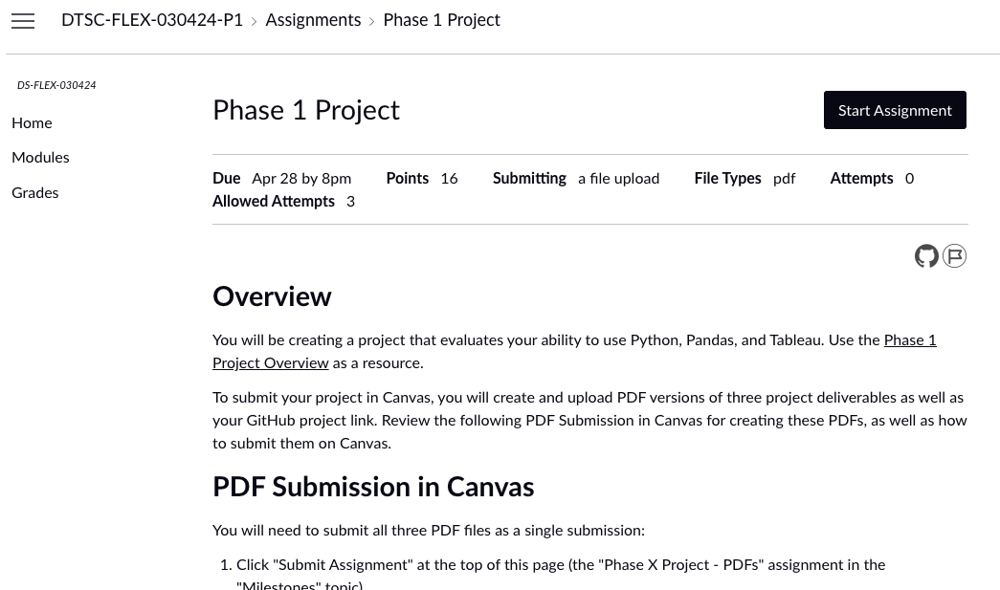
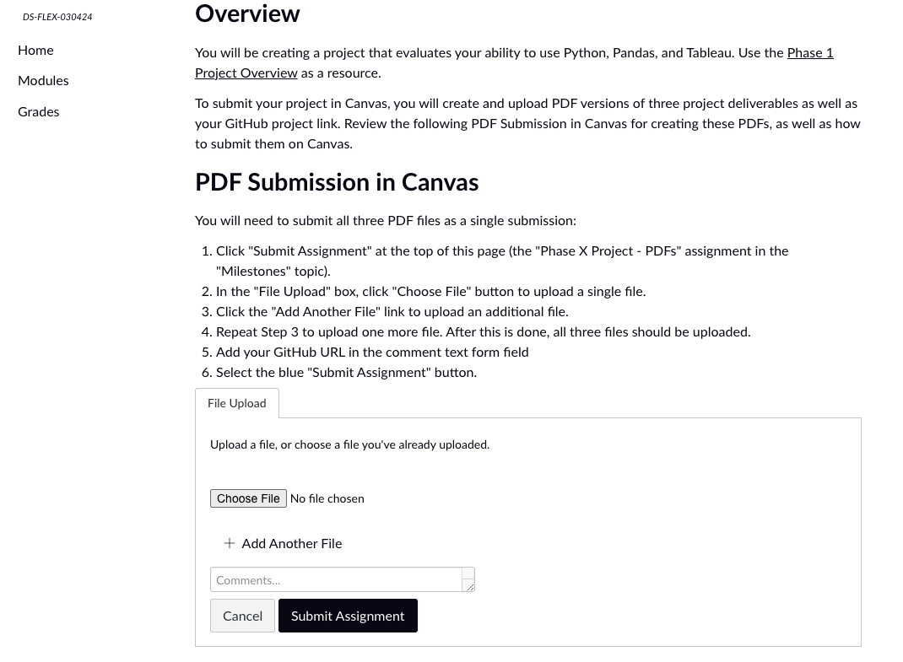
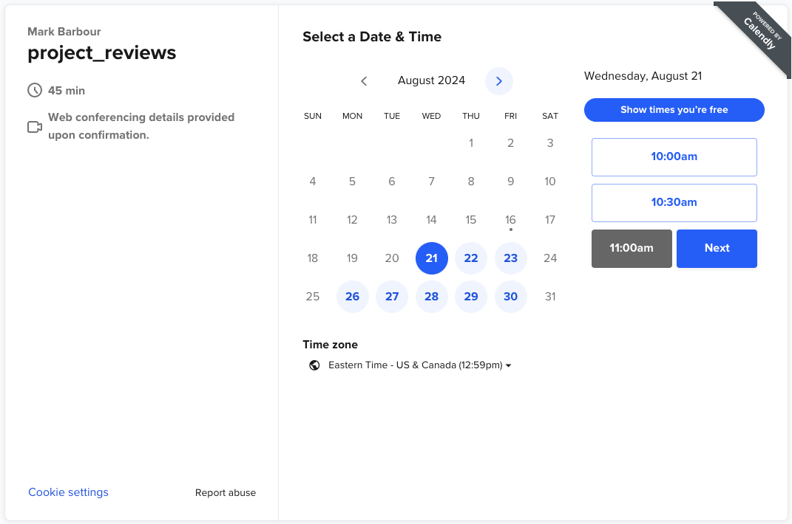
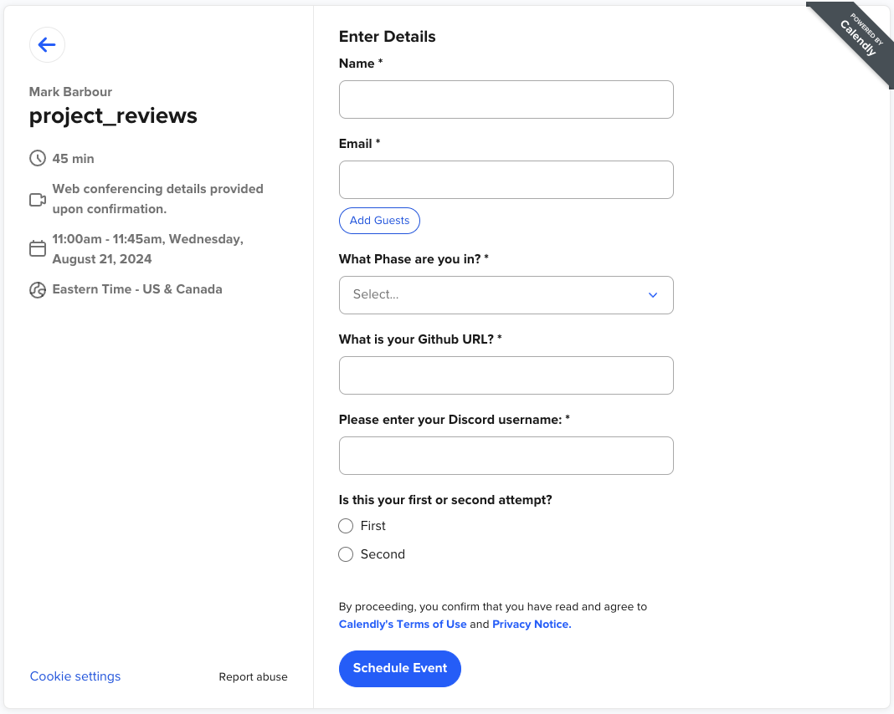

🎯Phase 1 Project Overview  
-------------------------  

After completing Topics 1-10, you should be all set to tackle the [Phase 1 Project](https://github.com/learn-co-curriculum/dsc-phase-1-project-v3)!

The Phase 1 Project is your first start-to-finish task where you have a lot of freedom in:  

* the data you use,  
* the questions you ask, and  
* the way you answer those questions.  

Overall the project should take 20-40 hours to complete. To stay on pace, you should aim to complete the project in the following # of weeks:  

* 20-week pace: 1 week  
* 40-week pace: 2 weeks  
* 60-week pace: 3-4 weeks  

Your instructor can help you find out exactly how many days you should spend on your end-of-phase project using the Flex Cadence and Milestones Calendar - please ask if you need help planning your project time!  

At the end of the project, you will have a live Project Review session with an instructor. Passing that review is how you progress to the next Phase, and you are required to pass all Phase Project Reviews in numerical order to complete the course.  

Project Requirements  
--------------------  

The project requirements are spelled out in both:  

1. the rubric attached to the Phase 1 Project [[Assignment Link 🔗 ]()]  
2. the [Phase 1 Project Submission Checklist](https://docs.google.com/document/d/1ZFN9zle3-18Mtq2doEjMr3aUx2wCVySlQXzWuZiv_EY/edit)  

There is a more concise Rubric/Checklist Spreadsheet that is a helpful project management template. You can find the spreadsheets for each phase on the [ds_flex_resources repo](https://github.com/mark-barbour/ds_flex_resources).

In brief, the major 3 deliverables include:  

* A jupyter notebook with your technical analysis  
* A 5-10 minute non-technical executive summary presentation  
* A GitHub repository that contains:  
	+ the .ipynb notebook file  
	+ the .pdf of your presentation  
	+ a README summarizing your results  

Getting Started:  
----------------  

When you're ready to begin the project, you will need to complete the [***Project Proposal***](#assignment_link).  

When you're ready to begin the project, we recommend you do 4 things:

1. Complete the Project Proposal in Canvas.
2. Message your instructor on Discord and indicate you've submitted the Project Proposal. Once the instructor grades the proposal, you will be granted access to the Project Submission Pages.
3. Create your GitHub repository where you can save all of your work.
4. Schedule a Project Review session with an instructor. ([Phase 1 Project Review Booking Link)](https://calendly.com/flex_booking_mark/project_reviews))
	* Note: you are **allowed to continue to refine and update your project/repo up until 24 hours before your review,** at which point the submitted materials will be considered final.

Submitting Your Project on Canvas
---------------------------------

* You will turn in your project materials to Canvas by going to the Phase 1 Project assignment and clicking Start Assignment.

* Upload the 3 PDFs for each of your deliverables (Notebook.pdf, Slides.pdf, README.pdf) to Canvas and click Submit.

* After doing so, please complete the [End of Phase survey](https://learn.co/redirect/student-nps-survey?Discipline=Data%20Science) and message your instructor in Discord immediately. 
	* They will then open up the next Phase for you provided your phase cumulative grade is at least 70% so that you can begin to work through the next Phase's lessons while you await your review. If you are below a 70%, please schedule a 1:1 with your instructor.

### Scheduling Your Review

Schedule your review using the Phase 1 Project Booking Page ([Phase 1 Project Review Booking Link)](https://calendly.com/flex_booking_mark/project_reviews)

1. First, confirm your auto-detected time zone looks correct. If not, use the dropdown to select your timezone.
   

2. Then, on the calendar that appears, select a day and then a time from the calendar that works for you to take the assessment and click Next.

   

3. After selecting a time slot you should see a form requesting information about you and your project materials. Fill out each field and submit.

Note: you are allowed to **continue to refine and update your project/repo up until 24 hours before your review**, at which point the submitted materials will be considered final. 

Project Review Format
----------------------

* First, you will talk through your **5-8 minute, non-technical presentation**.
+ The reviewing instructor will ask you a question or two as if they were your target audience.
+ The reviewing instructor will then discuss any feedback or action items for the presentation. This section takes approximately 15-25 mins depending on the level of feedback necessary.
* Next, you will go through your GitHub repo and **technical notebook**.
+ Please have the notebook open and pre-run before your review.
+ Depending on which project it is, the reviewing instructor will focus on a few areas of the notebook and generally will NOT have you talk through 100% of it

* After reviewing the notebook and presentation, the reviewing instructor will submit feedback based on the rubric in Canvas (with the changes requested, if relevant)

 

With all that in mind - go forth and create the first big ticket item for your data science portfolio, we can't wait to see it!

